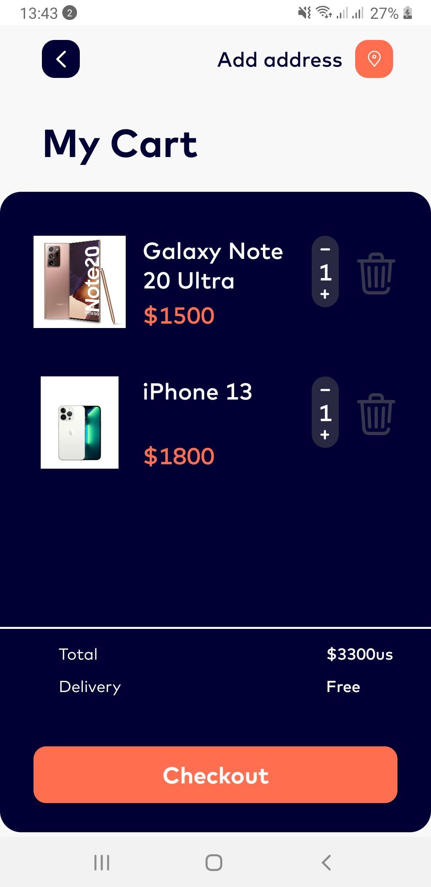

# Effective Mobile

Effective Mobile - Mobile application for to buy smartphones. 
The system will allow customers to receive information about mobile products (smartphones 
and their characteristics), purchase mobile phones.

## Screenshots

	
	
	
	
	
	

## Table of contents 📖
-[Initial project setup](#Initial project setup)
-[Open the project in Android Studio](#Open the project in Android Studio)
-[Technologies](#Technologies)
-[Documentation](#Documentation)

##Initial project setup

To start the project, you need to copy the project link https://github.com/VictoriaRydina/Effective-Mobile.git
and open a new project in Android Studio using it

##Open the project in Android Studio

Open Android Studio, make sure you are on the development branch and then in the top right corner 
click on the “Sync Project with Gradle Files” icon or in the top left corner “File” -> 
“Sync Project with Gradle Files”

##Technologies

* Kotlin
* Dagger 2
* Clean Architecture
* MVVM
* Kotlin Coroutines
* Retrofit2
* Picasso

##Documentation

[Technical requirements](https://docs.google.com/document/d/1WwvOBv9_W6yw2Ehx_2vGuEurMko1Es01s5VVpr_PRAQ/edit)